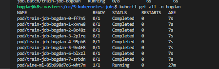

```bash
# for delete
kubectl delete job train-job-bogdan -n bogdan

# creating namespace
kubectl create namespace bogdan

# for creating configmap
kubectl apply -f config-map.yaml -n bogdan

# apply train job
kubectl apply -f train-job.yaml -n bogdan

# get
kubectl get jobs -n bogdan
kubectl get all -n bogdan

# describe
kubectl describe pod train-job-bogdan-0-xkwjk -n bogdan
kubectl logs train-job-bogdan-0-xkwjk -n bogdan
```

